# Programming fonts

## Useful Resources  
Use [Nerd Fonts](https://github.com/ryanoasis/nerd-fonts) to patched fonts for icons.  
Use [Font Manger](https://github.com/FontManager/font-manager) for browsing and managing fonts.  
https://www.codingfont.com/  
https://www.programmingfonts.org/  

### Theme is One Dark  
### Screenshots made with [Carbon](https://carbon.now.sh)
 

[ABCSans](https://www.cufonfonts.com/font/abcsans)  
Rating: 8.5  
FREE

[Anonymous Pro](https://www.marksimonson.com/fonts/view/anonymous-pro)  
Rating: 8.5  
Very clean looking font. The name Anonymous Pro is also cool.  
FREE
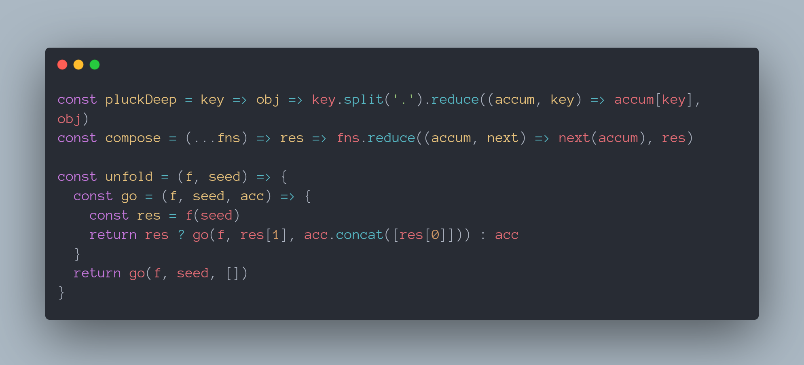

[Arial](https://docs.microsoft.com/en-us/typography/font-list/arial)  
Rating: 8.5  
Surprisingly clean and easy to read font. Comes standard on a lot of devices but I was sleeping on this font.  
I couldn't find a way to install this but I found it on my Ubuntu pc.  
FREE?

[B612 Mono](https://fonts.google.com/specimen/B612+Mono)  
Rating: 9  
Nice font. Parenthesis are growing on me.  
FREE

[Cartograph CF](https://connary.com/cartograph.html)  
Rating: N/A  
PAID  

[Cascadia Code](https://github.com/microsoft/cascadia-code)  
Rating: 8  
Solid font. Very "soft" looking.  
FREE
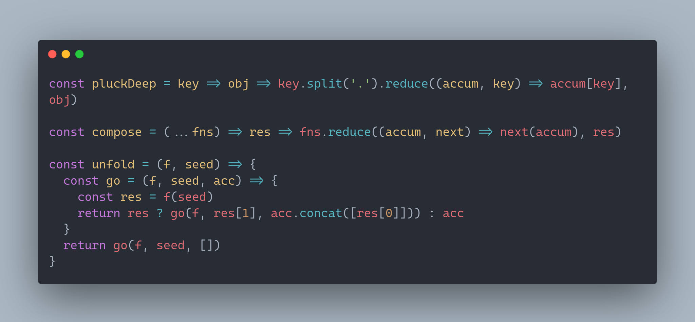

[Cascadia Mono Semilight](https://github.com/microsoft/cascadia-code)  
Rating: 9.5  
Really good font. Been using this more over Comic Mono as this looks better at smaller font sizes.  
FREE
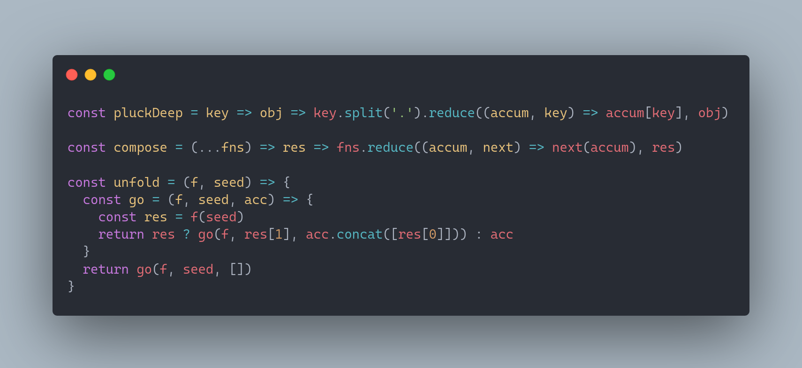

[CMU Typewriter Text](https://www.cufonfonts.com/font/cmu-typewriter-text)  
Rating: 8.5  
FREE  

[Comic Code](https://tosche.net/fonts/comic-code)  
Rating: N/A  
This font looks good but I haven't tried it yet.  
PAID  

[Comic Mono](https://github.com/dtinth/comic-mono-font)  
Rating: 9.5  
This is a fork of Comic Shanns and it is currently my favorite font. Only complaint is the capital M and W.  
FREE
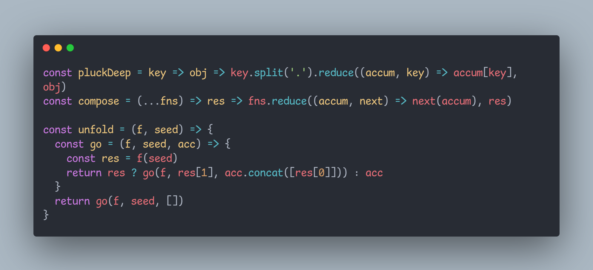

[Comic Shanns](https://github.com/shannpersand/comic-shanns)  
Rating: 9  
This font is one of my favorite variations on Comic Sans.  
FREE

[Consolas Mono](https://docs.microsoft.com/en-us/typography/font-list/consolas)  
Rating: N/A  
Comes default with windows and used in Notepad, Office, Visual Studio. I don't know if you can download this.    
FREE?

[Cousine](https://fonts.google.com/specimen/Cousine)  
Rating: 8.5  
Solid font.  
FREE  
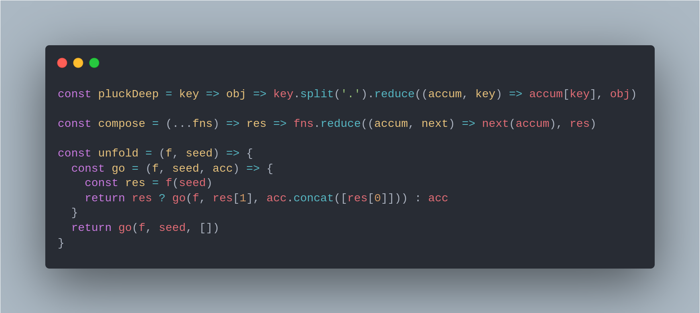

[DM Mono](https://github.com/googlefonts/dm-mono)  
Rating:  N/A  
FREE
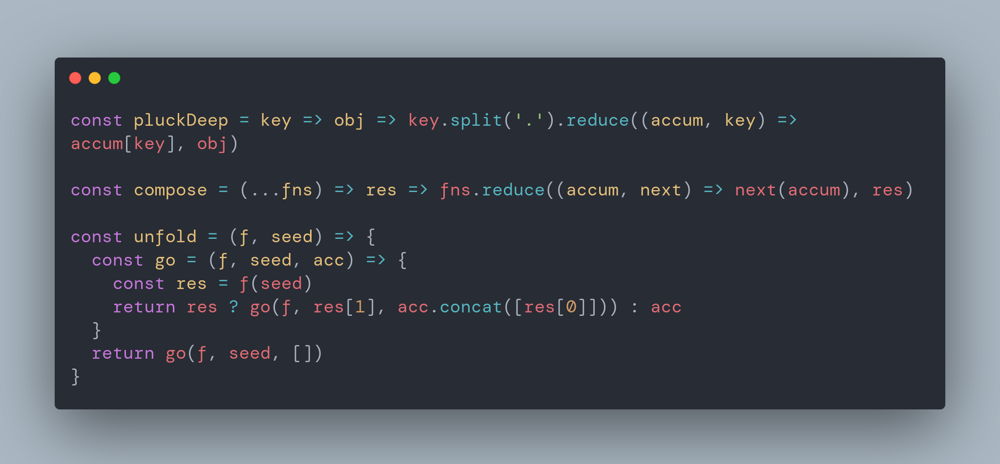

[Fantasque Sans Mono](https://github.com/belluzj/fantasque-sans)
Rating: 9  
FREE  

[Fira Code](https://github.com/tonsky/FiraCode)  
Rating: 9  
The most starred font on Github. Solid choice.  
FREE
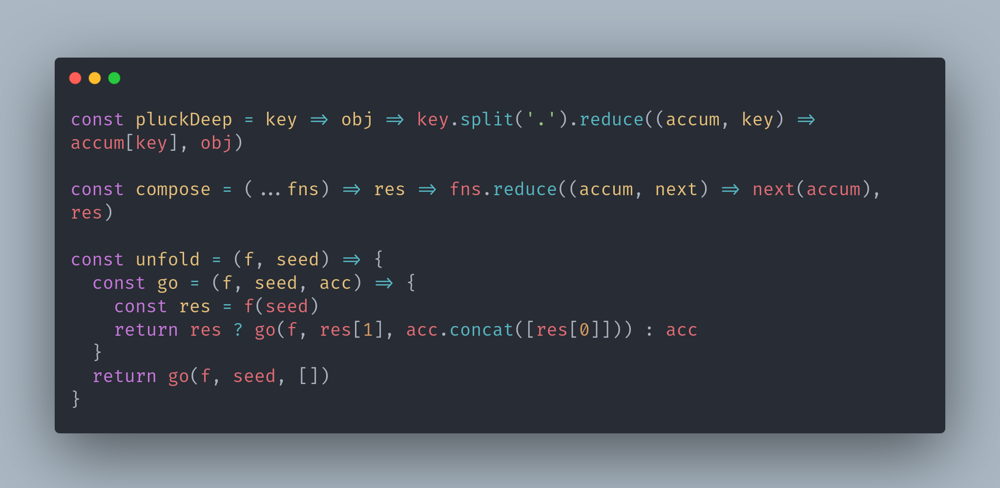

[Hack](https://github.com/source-foundry/Hack)  
Rating: 9  
The second most starred font on Github. Close competitor to Fira Code.  
FREE
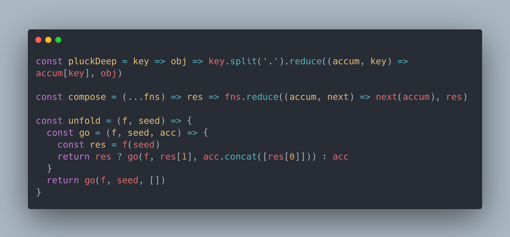

[Inconsolata](https://github.com/googlefonts/inconsolata)  
Rating: N/A  
FREE

[Input Mono](https://input.djr.com/)  
Rating: N/A  
FREE  

[Inter](https://github.com/rsms/inter/)  
Rating: N/A  
FREE
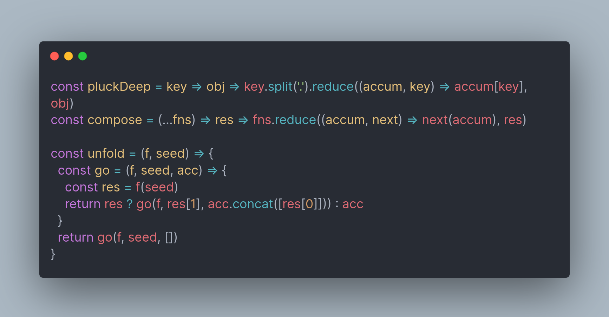

[Jetbrains Mono](https://github.com/JetBrains/JetBrainsMono)  
Rating: 8.5  
Good font. Default on all Jetbrain IDE's.  
FREE

[Liberation Mono](https://www.fontsquirrel.com/fonts/liberation-mono)  
Rating: 8.5
Very clean font. Spent a while looking for it after seeing it in the Sublime Text popup.  
FREE
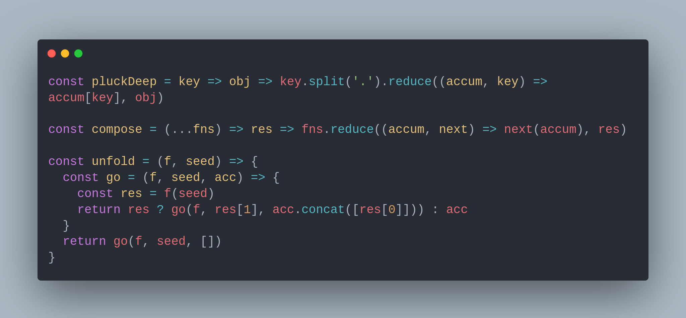

[Magnetic Mono](https://www.myfonts.com/fonts/mostardesign/magnetic-pro/)  
Rating: 8.5  
Nice wonky font.  
PAID  

[Manrope](https://fonts.google.com/specimen/Manrope)  
Rating: 8  
Nice looking web font. Not so much for programming.  
FREE  

[Merriweather](https://fonts.google.com/specimen/Merriweather)  
Rating: N/A  
FREE  

[Monaco](https://www.cufonfonts.com/font/monaco)  
Rating: N/A  
FREE  

[Monofur](https://www.dafont.com/monofur.font)
Rating: 7.5  
Decent font but a little thin. Wish it had a thicker variant.  
FREE
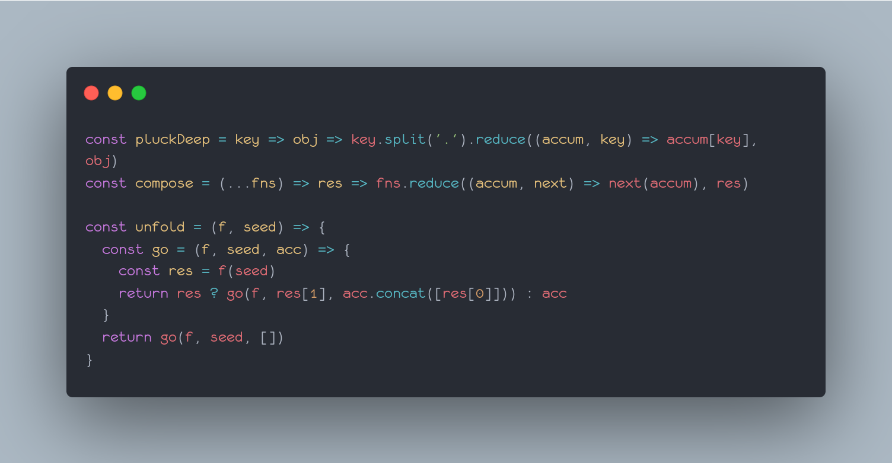

[Monolisa](https://www.monolisa.dev/)  
Rating: N/A  
PAID

[Menlo](https://en.wikipedia.org/wiki/Menlo_(typeface))  
Rating: 8  
FREE?  
You can find the download link with a quick search.  
FREE?  
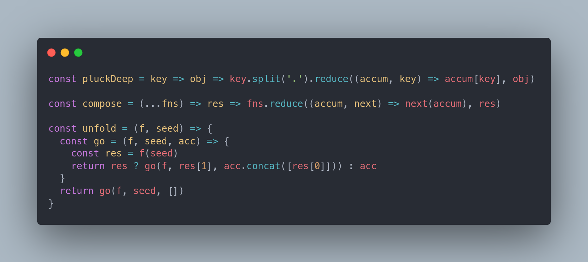

[Noto Sans Mono](https://fonts.google.com/noto/specimen/Noto+Sans+Mono)
Rating: 9  
FREE  
I like most of the fonts in this [family](https://fonts.google.com/noto/fonts)
but this is the one I've used the most.  

[Operator Mono](https://www.typography.com/blog/introducing-operator)  
Rating: N/A  
PAID  

[Overpass Mono](https://fonts.google.com/specimen/Overpass+Mono)  
Rating: 8  
FREE  

[PT Mono](https://fonts.adobe.com/fonts/pt-mono)  
Rating: 9.5  
This was the font I used before switching to Comic Mono.  
FREE

[Public Sans](https://fonts.google.com/specimen/Public+Sans)  
Rating:  
FREE  

[Roboto Mono](https://fonts.google.com/specimen/Roboto+Mono)  
Rating: 9  
Clean font. Very googly.  
FREE
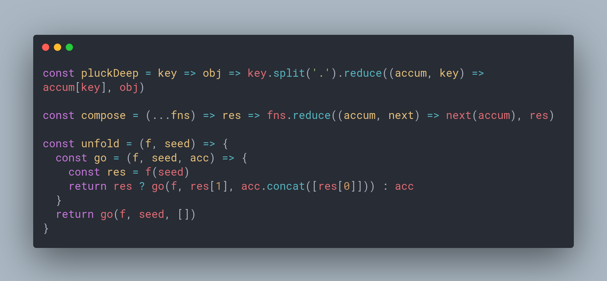

[Readex Pro](https://fonts.google.com/specimen/Readex+Pro)  
Rating:  
FREE  

[Rec Mono](https://www.recursive.design/)  
Rating: 9  
Similar to the comic-* family fonts. Semicasual might be the best.  
FREE  

[SF Mono](https://developer.apple.com/fonts/)  
Rating: 9.5  
This is the font on Apple devices.  
This font looks best on a high resolution monitor otherwise it is a bit blurry.  
FREE
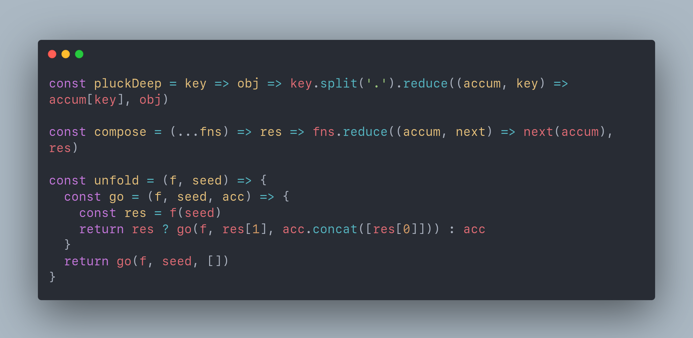

[SF Mono Semibold](https://developer.apple.com/fonts/)
Rating: 9.5
This is similar to SF Mono but I've been really liking this font for coding.  
The extra bold makes things looker nicer.  
FREE

[Share Tech Mono](https://fonts.google.com/specimen/Share+Tech+Mono)  
Rating:  
FREE
!

[Source Code Pro](https://github.com/adobe-fonts/source-code-pro)  
Rating: N/A  
FREE
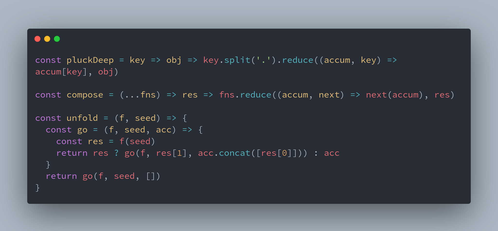

[Space Grotesk](https://fonts.google.com/specimen/Space+Grotesk)  
Rating: 8.5  
Nice looking web font.  
FREE  

[Space Mono](https://fonts.google.com/specimen/Space+Mono)  

[Syne Mono](https://fonts.google.com/specimen/Syne+Mono)

[Ubuntu Mono](https://fonts.adobe.com/fonts/ubuntu-mono/details/i7)  
Rating: 8  
Very recognizable font if you have downloaded Ubuntu at some point.  
FREE
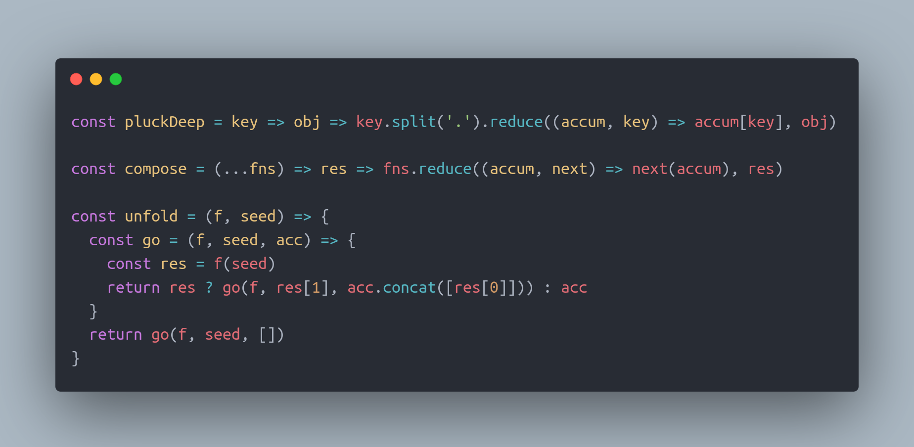

[Victor Mono](https://github.com/rubjo/victor-mono)  
Rating: 9  
Nice font. Semibold is my favorite.  
FREE  

